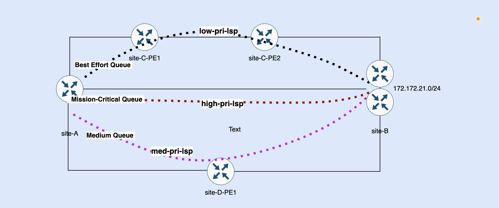

# Class Based Forwarding over RSVP LSPs Design Consideration

In my previous write-ups, I covered Class of Service (CoS) design considerations and various other traffic engineering mechanisms, including Faster Auto-Bandwidth Adjustment and Container LSP. While these features address modern traffic engineering challenges, there may still be a business need to classify traffic such that high-priority or mission-critical traffic travels via the shortest or best path, medium-priority traffic follows the second-best path, and low-priority traffic is routed via the longest link.

Class-Based Forwarding (CBF) addresses this challenge by directing traffic of each specific forwarding class to label-switched paths that align with business requirements. This solution assumes traffic classification occurs either through behavior aggregate or multi-field classifierer and traffic directed to respective forwarding queue on egress interfaces. Label-switched paths are mapped to these forwarding classes, ensuring that certain types of traffic are transmitted through designated egress interface queues and specific label-switched paths.

## Solution Brief 

Let’s suppose Site-A needs to communicate with Site-B. As shown in the topology diagram above, there are three distinct paths available between these sites. The direct path between Site-A and Site-B is the shortest and optimal path in terms of latency, making it the ideal candidate for handling mission-critical traffic within high-priority Label-Switched Paths (LSPs). The path passing through Site-C is the second-best option, making it suitable for handling medium-priority traffic within "Medium" forwarding class LSPs. Finally, the path passing through Site-D has the highest latency and is best suited for carrying lower-priority traffic within the Best-Effort forwarding class.

This approach ensures each traffic class is efficiently directed according to its priority and latency requirements, aligning with Class-Based Forwarding principles to optimize path selection based on business-driven performance needs.